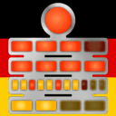

# BerlinClockKata
Solving the Berlin Clock Kata throught Test-Driven Development.

  

## Contributors 
This project was developed with the help of the following members:
- **[Georgi Popgerorgiev](https://github.com/georgi-popgeorgiev-vinci)**
- **[Hugo Dandois](https://github.com/hugodandois)**
- **[Robin Lamotte](https://github.com/yourprofile)**

## Problem Description

The Berlin Clock (also known as the "Mengenlehreuhr") is a clock that tells the time using a series of illuminated colored lights. Your task is to implement the Berlin Clock and display the time in a way similar to the clock's visual representation.

### Berlin Clock Components

1. **Seconds Row**:
   - A single yellow lamp at the top of the clock blinks every second. If the number of seconds is even, the lamp is on (Y); if odd, the lamp is off (O).

2. **Five Hour Row**:
   - The second row contains 4 red lamps. Each lamp represents 5 hours. For example, 10 hours would be represented as `RROO`.

3. **Single Hour Row**:
   - The third row contains 4 red lamps. Each lamp represents 1 hour. For example, 2 hours would be represented as `RROO`.

4. **Five Minute Row**:
   - The fourth row contains 11 lamps. Each lamp represents 5 minutes. The lamps are yellow (Y), except for the 3rd, 6th, and 9th lamps which are red (R), indicating 15, 30, and 45 minutes respectively. For example, 15 minutes would be represented as `YYROO`.

5. **Single Minute Row**:
   - The bottom row contains 4 yellow lamps. Each lamp represents 1 minute. For example, 4 minutes would be represented as `YYYY`.

### Example

Given the time "13:17:01" (1:17:01 PM), the Berlin Clock would display:
`O RROO RRRO YYROOOOOOOO YYOO`

### Implementation

This project implement the Berlin Clock by following the principles of Test-Driven Development (TDD) and pair programming. This means writing unit tests for each component of the clock before implementing the functionality. The goal is to ensure that your implementation is correct, maintainable, and well-tested.
